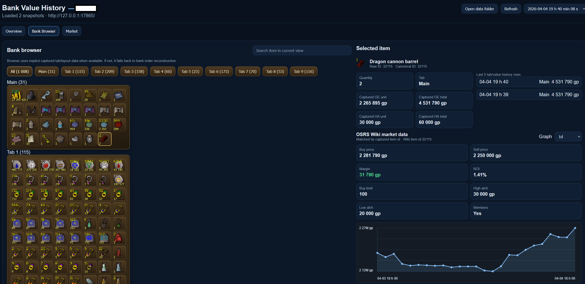
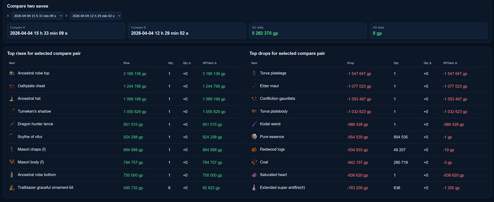
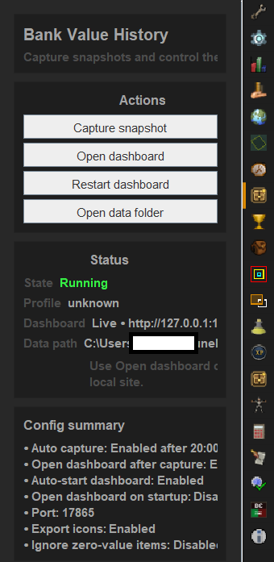
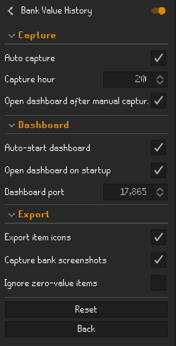

# Bank Value History

Bank Value History tracks your bank value over time inside RuneLite.

## Features
- Capture bank snapshots
- Compare snapshots over time
- Browse item history
- View local charts and history
- Optional bank screenshot capture
- Optional local dashboard

## How it works
The plugin stores bank snapshot data locally on your computer so you can review changes over time.

## Local dashboard
The dashboard is intended for local use on the same machine.

## Privacy and storage
- Snapshot data is stored locally
- Optional screenshots are stored locally
- The dashboard is intended for localhost use only

## Screenshots

### Bank browser

### Snapshot comparison

### Plugin panel

### Plugin settings

## Support
Use the Issues tab in this repository to report bugs or request features.
